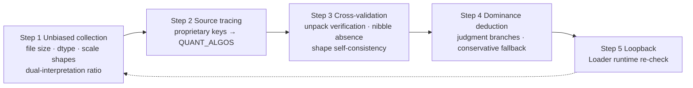
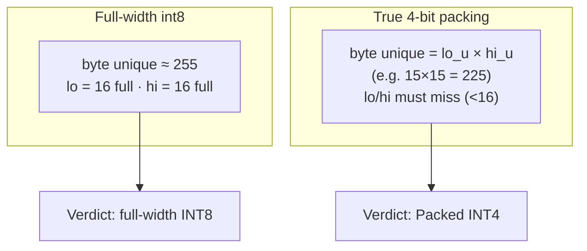
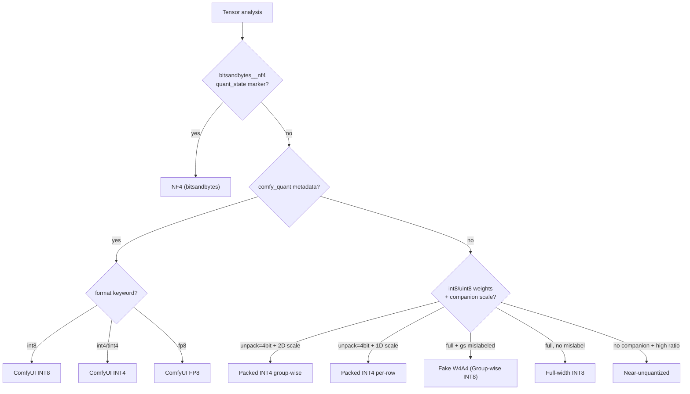

# MFV — Model Format Verifier

Unbiased, cross-validated reverse-engineering tool for model weight quantization and packing formats.

**Trusts no filenames, trusts no metadata** — only physical sizes, tensor structures, and unpacking characteristics are hard evidence for determining a model's true quantization format and packing layout.

> **中文版**：[README.zh-CN.md](README.zh-CN.md)

## Features

- **Multi-format detection**: ComfyUI INT8/INT4/FP8/NF4, Packed INT4 (group-wise / per-row byte packing), bitsandbytes NF4, torchao int32, GGUF block quantization (Q2_K~Q8_K / IQ series), unquantized (FP16/BF16/FP8)
- **Evidence-driven**: nibble-absence + byte-unique combination is the hard evidence for packing; protocol ownership verified against defining source registries (e.g. ComfyUI `QUANT_ALGOS`), never name-guessed
- **5-zone output**: 💡 Quick Overview / 📊 Performance & Structure / 🔍 Deep Diagnosis / 📋 Filename Audit / Final Verdict — pick what you need
- **Bilingual**: `--lang auto|zh|en` (default `auto`, follows system locale); terms stay English, framework text localizes
- **Cross-platform**: pure Python + torch + safetensors, CLI on Windows/macOS/Linux

## Quick Start

```bash
pip install torch safetensors

python check_model.py <model.safetensors>     # single file
python check_model.py <model.gguf>
python check_model.py <model_dir>             # batch scan
python check_model.py --lang en <path>        # force English output
```

## Sample Output

```

================================================================================
 📦 MFV Model Checker v1.1.0
================================================================================
 File: Flux.2-Klein-9B-Turbo_tint4_torchao.safetensors
 Size: 4.91 GB
 Path: /path/to/models/

--------------------------------------------------------------------------------
 💡 Quick Overview
--------------------------------------------------------------------------------
  • Type: ComfyUI INT4 (tint4_torchao)
  • Loader: ComfyUI native / TINT4 nodes (comfy_quant protocol)
  • VRAM ref: disk 4.91 GB (est.; ~71% saved vs full FP16)

--------------------------------------------------------------------------------
 📊 Performance & Structure
--------------------------------------------------------------------------------
  • Raw equiv: ~17.16 GB (FP16 base)
  • VRAM saving: ~71% ⏬ (4-bit packing)
  • Quant protocol: comfy_quant (format: tint4_torchao)
  • Quant mechanism: int32 packing (8×4bit per int32) + channel-wise scaling

 [Activation Width (A) Derivation]
  • Model metadata: comfy_quant.format=tint4_torchao, per_block, quarot, gs=128
  • File suffix:   .safetensors
  • Weight width W: 4 bit
  • Activation width A: A16 primary (ComfyUI default), A8 optional   ⚠ engine-dependent, not file evidence

--------------------------------------------------------------------------------
 🔍 Deep Diagnosis
--------------------------------------------------------------------------------
 [Tensor & dtype Distribution]
  • total keys: 765
  • key suffixes: .weight: 121 | .weight_b0: 112 | .weight_b1: 112 | .weight_scale: 112 | .weight_zp: 112 | .comfy_quant: 112 | .scale: 80 | .(none): 4
  • dtype: torch.uint8: 113 | torch.int32: 112 | torch.float16: 112 | torch.int8: 112 | torch.bfloat16: 89
  • scalar metadata {'torch.int32': 225, 'torch.uint8': 2} excluded (e.g. w4a4_group_size)

 [Compression Ratio (dual interpretation)]
  • actual: 4.91 GB | full FP16 baseline: ~17.16 GB
  • ratio: 29%
  • verdict: 29% (by final type ComfyUI INT4 (tint4_torchao))

 [Quantized Layers & Sample Verification]
  • format distribution: torchao int32 packed: 80 layers
  • example: double_blocks.0.img_attn.proj.weight_scale
      └─ weight 4096x512 int32, scale (32, 4096)
  • comfy_quant: {"format": "tint4_torchao", "per_block": true, "quarot": true, "group_size": 128}


--------------------------------------------------------------------------------
 📋 Filename Audit
--------------------------------------------------------------------------------
 [Original Filename]
  Flux.2-Klein-9B-Turbo_tint4_torchao.safetensors

 [Per-Segment Verification]
  • Arch:   claimed Flux -> file Flux  ✓ match
  • Params: claimed 9.0B -> file 9.2B  ✓ match
  • Quant/Precision: claimed tint4_torchao  →  file ComfyUI-INT4  ✓ match

 [Standardized Naming]
  Flux.2-Klein-9B-Turbo-ComfyUI-INT4
  (identity segments kept as-is; only quant segment corrected/filled by file evidence)

================================================================================
 Final Verdict
================================================================================
  [key] weight_scale companion tensors  (112)
  [key] comfy_quant metadata  (112 -> ComfyUI protocol)
  [key] weight_zp (zero-point)  (112)
  [dtype] int8 tensors present  (112)
  [dtype] int32 packed weights (likely torchao)  (int32 weight + scale)
  [dtype] bf16 (unquantized) present  (89)
  [ratio] true INT4 level  (29%)
  [structure] torchao int32 packed  (80 layers dominant)
  [metadata] comfy_quant.format=tint4_torchao
  [metadata] group_size=128
  [metadata] quarot rotation
--------------------------------------------------------------------------------
  → Type: ComfyUI INT4 (tint4_torchao)
  → Basis: comfy_quant proprietary metadata (ComfyUI official protocol, not torchao)
  → Loader: ComfyUI native / TINT4 nodes (comfy_quant protocol)
  → Structure: int32 packed + weight_scale/zp companions (TINT4/ComfyUI protocol); quantized layers 80 layers dominant: torchao int32 packed
================================================================================
```

## Three Ways to Use

### 1. CLI (core, cross-platform)

```bash
python check_model.py <path>
```

### 2. AI Agent Skill (cross-agent)

The bundled `skill/` directory is a standard **SKILL.md package** (Anthropic Agent Skills open spec; compatible with Claude Code / Cursor / WorkBuddy etc.).

```bash
# skills.sh CLI (cross-agent standard)
npx skills add allanmeng/model-format-verifier@skill

# or manual: copy skill/ into your agent's skills dir (~/.claude/skills, ~/.cursor/skills, ...)
```

### 3. Windows Context Menu (two zero-dependency options)

**Option A: Send To**

```
scripts\install_sendto.bat
```

**Option B: Classic context menu (direct menu items)**

```
scripts\install_classic_reg.bat        # uninstall: ... uninstall
```

Both coexist fine. The detection scripts have a CONFIG section at top (PYTHON path; leave empty to use PATH python).

## Project Layout

```
model-format-verifier/
├── check_model.py           # core detector (authoritative source)
├── skill/                   # agent skill package
│   ├── SKILL.md             # 5-step analysis protocol
│   ├── scripts/check_model.py
│   └── references/          # environment + case studies
├── scripts/
│   ├── mfv_check.bat            # context-menu check (CONFIG-parameterized)
│   ├── mfv_scan.bat             # context-menu batch scan
│   ├── install_sendto.bat       # integration A: Send To
│   └── install_classic_reg.bat  # integration B: classic context menu
└── tests/
    └── run_regression.py    # case-library regression assertions
```

## Core Verification Logic

**MFV (Model Format Verifier)** derives from the Model Format Verifier Protocol — an unbiased, cross-validated reverse-engineering paradigm.

### Five Core Principles

1. **Unbiased evidence**: filenames, `w4a4_group_size`, `format` fields can all lie; only physical sizes and unpacking characteristics count
2. **Source tracing**: protocol ownership verified against defining registries (`comfy_quant` → ComfyUI `QUANT_ALGOS`, **not** torchao)
3. **Strict discriminative power**: each criterion must exclude competing hypotheses; only hard evidence survives (e.g. nibble-absence + byte-unique)
4. **Dominance with degradation**: dominant structure (>50% sampled layers) decides; insufficient evidence → conservative "suspected/pending"
5. **Loopback feedback**: real Loader runtime behavior exposes detection flaws; fixes stay plugin-agnostic

### 5-Step Workflow



### Hard Criterion: Nibble Absence & Byte Unique

4-bit packing = "two 4-bit values per byte", leaving unforgeable byte-level traces:



### Decision Tree



- Conservative rule: insufficient evidence → "suspected/pending"; better to say nothing than to guess wrong.

## Case Studies

| Model | Claimed | Actual | Flaw exposed |
|-------|---------|--------|--------------|
| kr2fp_wa4 | filename wa4 | Packed INT4 | dead-branch misjudgment |
| krea2_turbo-int8_convrot | filename int8 | INT4 per-row packed | filename untrustworthy |
| z_image_turbo_int8_convrot | comfy_quant | ComfyUI INT8 | ownership misjudged as torchao |
| z_image_turbo_nf4_v2 | filename nf4 | NF4 (bitsandbytes) | bnb system missed |
| qwen_3_4b_fp4_flux2 | filename fp4 | FP8 (float8_e4m3fn) | float8 format unrecognized |
| Huihui-Qwen3VL-int8_mixed | filename int8 | INT4 per-row packed | filename int8 again misleading |

Full details in `skill/references/case-studies.md`.

## License

MIT

## Contributing

- Authoritative source: root `check_model.py` (single upgrade target)
- New formats follow "counter-example driven": misdetection → model evidence → new criterion → case study
