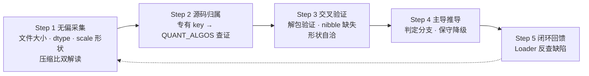
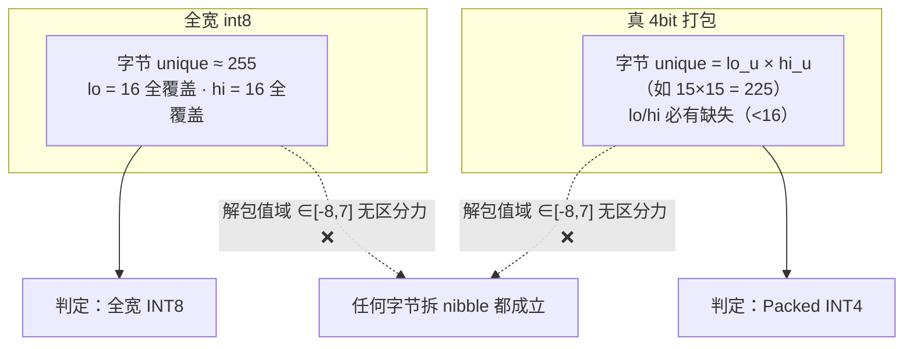
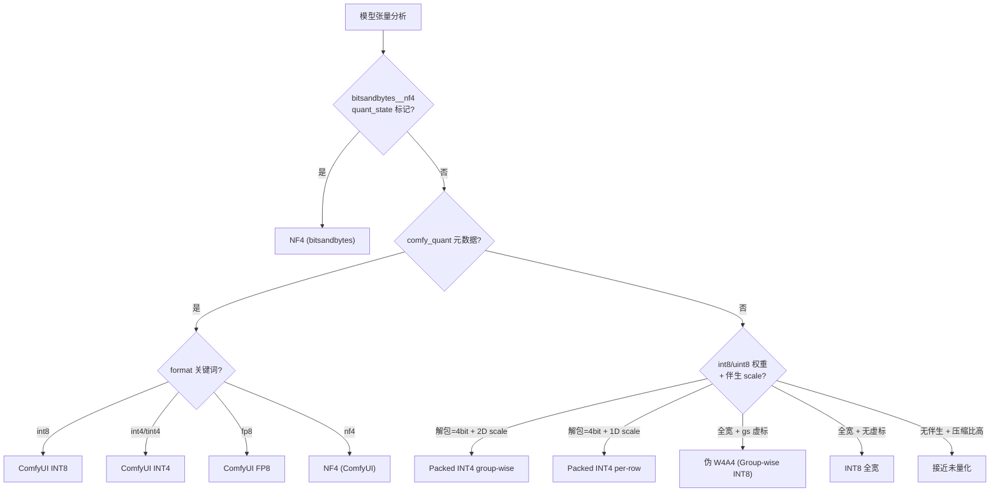

# MFV — 模型格式验证工具（Model Format Verifier）

> **English version**：[README.md](README.md)

无偏、交叉验证的模型权重量化与打包格式逆向分析工具。

**不信任文件名、不信任元数据**——只以底层物理尺寸、张量结构和解包特征为硬证据，判定模型真实的量化格式与打包布局。

## 特性

- **多格式识别**：ComfyUI INT8/INT4/FP8/NF4、Packed INT4（group-wise / per-row 字节打包）、bitsandbytes NF4、torchao int32、GGUF 分块量化（Q2_K~Q8_K / IQ 系列）、未量化（FP16/BF16/FP8）
- **证据驱动**：nibble 缺失模式 + 字节 unique 组合是打包判定的硬证据；协议归属以定义方源码注册表为准（如 ComfyUI `QUANT_ALGOS`），拒绝名称联想
- **双层次输出**：💡 普通用户速览 / 📊 性能与结构评估 / 🔍 开发者深度诊断 / 终审结论，四区模板各取所需
- **跨平台**：纯 Python + torch + safetensors，Windows / macOS / Linux 命令行直跑

## 快速开始

```bash
# 安装依赖
pip install torch safetensors

# 单文件分析（safetensors 或 GGUF）
python check_model.py <模型.safetensors>
python check_model.py <模型.gguf>

# 批量扫描目录
python check_model.py <模型目录>
```

## 输出示例

```

================================================================================
 📦 MFV 模型检查工具 v1.1.0
================================================================================
 文件: Flux.2-Klein-9B-Turbo_tint4_torchao.safetensors
 大小: 4.91 GB
 路径: /path/to/models/

--------------------------------------------------------------------------------
 💡 【普通用户速览】
--------------------------------------------------------------------------------
  • 模型类型: ComfyUI INT4 (tint4_torchao)
  • 典型加载: ComfyUI 原生 / TINT4 节点 (comfy_quant 协议)
  • 显存参考: 磁盘 4.91 GB (估算; 相比全 FP16 约省 71%)

--------------------------------------------------------------------------------
 📊 【性能与结构评估】
--------------------------------------------------------------------------------
  • 原始等效: ~17.16 GB (FP16 基础)
  • 显存节省: 约 71% ⏬ (4bit 打包)
  • 量化协议: comfy_quant (format: tint4_torchao)
  • 量化机制: int32 打包（每 int32 装 8×4bit）+ 通道级缩放

 [激活位宽 (A) 推导]
  • 模型元数据: comfy_quant.format=tint4_torchao, per_block, quarot, gs=128
  • 文件后缀:   .safetensors
  • 权重位宽 W: 4 bit
  • 激活位宽 A: A16 为主（ComfyUI 默认）, A8 可选   ⚠ 引擎相关, 非文件证据

--------------------------------------------------------------------------------
 🔍 【开发者深度诊断】
--------------------------------------------------------------------------------
 [张量与数据类型分布]
  • 总 Key 数: 765
  • Key 后缀: .weight: 121 | .weight_b0: 112 | .weight_b1: 112 | .weight_scale: 112 | .weight_zp: 112 | .comfy_quant: 112 | .scale: 80 | .(none): 4
  • dtype: torch.uint8: 113 | torch.int32: 112 | torch.float16: 112 | torch.int8: 112 | torch.bfloat16: 89
  • 标量元数据 {'torch.int32': 225, 'torch.uint8': 2} 已排除 (如 w4a4_group_size)

 [压缩比评估 (双解读分析)]
  • 实际数据: 4.91 GB | 全 FP16 基准: ~17.16 GB
  • 压缩率: 29%
  • 裁决: 29% (按最终类型 ComfyUI INT4 (tint4_torchao) 选取)

 [量化层与采样验证]
  • 格式分布: torchao int32 打包: 80 层
  • 示例: double_blocks.0.img_attn.proj.weight_scale
      └─ weight 4096x512 int32, scale (32, 4096)
  • comfy_quant: {"format": "tint4_torchao", "per_block": true, "quarot": true, "group_size": 128}


--------------------------------------------------------------------------------
 📋 【文件名审计】
--------------------------------------------------------------------------------
 [原始文件名]
  Flux.2-Klein-9B-Turbo_tint4_torchao.safetensors

 [逐段核验]
  • 架构:   声称 Flux → 文件 Flux  ✓ 一致
  • 参数量: 声称 9.0B → 文件 9.2B  ✓ 一致
  • 量化/精度: 声称 tint4_torchao  →  文件 ComfyUI-INT4  ✓ 一致

 [标准化命名]
  Flux.2-Klein-9B-Turbo-ComfyUI-INT4.safetensors
  (身份段保留原样, 仅量化段按文件证据更正/补全)

================================================================================
 【终审结论】
================================================================================
  [key] 含 weight_scale 伴生张量  (112 个)
  [key] 含 comfy_quant 元数据  (112 个 → ComfyUI 量化协议)
  [key] 含 weight_zp (zero-point)  (112 个)
  [dtype] 存在 int8 张量  (112 个)
  [dtype] 存在 int32 打包权重 (疑似 torchao)  (int32 weight + scale)
  [dtype] 存在 bf16 (未量化层)  (89 个)
  [压缩] 真 INT4 级  (29%)
  [结构] torchao int32 打包  (80 层主导)
  [元数据] comfy_quant.format=tint4_torchao
  [元数据] group_size=128
  [元数据] quarot 旋转
--------------------------------------------------------------------------------
  → 类型识别: ComfyUI INT4 (tint4_torchao)
  → 识别依据: comfy_quant 专有元数据 (ComfyUI 官方量化协议, 非 torchao)
  → 典型加载: ComfyUI 原生 / TINT4 节点 (comfy_quant 协议)
  → 结构要点: int32 打包 + weight_scale/zp 伴生 (TINT4/ComfyUI 协议); 量化层 80 层主导: torchao int32 打包
================================================================================
```

## 三种使用方式

### 1. 命令行（核心，跨平台）

```bash
python check_model.py <路径>
```

适合所有平台，脚本即工具，零安装成本。

### 2. AI Agent 技能包（Skill，跨 agent 通用）

本仓库自带 `skill/` 目录，是标准 **SKILL.md 技能包**（Anthropic Agent Skills 开放规范，Claude Code / Cursor / WorkBuddy 等主流 agent 均兼容），内含五步分析范式 + 案例库 + 参考实现。

**通用安装方式一：skills.sh CLI（推荐）**

```bash
npx skills add allanmeng/model-format-verifier@skill
```

**通用安装方式二：手动放置**

把 `skill/` 目录复制到所用 agent 的技能目录即可（不同 agent 路径不同，如 `~/.workbuddy/skills/`、`~/.claude/skills/`、`~/.cursor/skills/` 等），重启后自动识别。

**通用安装方式三：ClawHub 社区市场**

已发布到 [clawhub.ai](https://clawhub.ai) 后可一键安装。

### 3. Windows 右键菜单（两种方案，零依赖）

**方案 A：发送到（推荐）**

```
scripts\install_sendto.bat
```

在系统 SendTo 目录创建快捷方式。之后右键 `.safetensors` / `.gguf` 文件 → **发送到 → Check Model** 检测；右键文件夹 → **发送到 → Scan Models** 批量扫描。

**方案 B：经典右键菜单（菜单项直接出现）**

```
scripts\install_classic_reg.bat
```

注册 HKCU 用户级右键菜单：右键 `.safetensors` / `.gguf` 直接出现 **Check Model** 菜单项，右键文件夹出现 **Scan Models**（Windows 11 显示在「显示更多选项」中）。卸载：`install_classic_reg.bat uninstall`。

> 两个方案可同时安装，互不冲突。检测脚本顶部 CONFIG 区可配置 Python 路径（留空则使用系统 PATH 中的 python）。

## 目录结构

```
model-format-verifier/
├── check_model.py           # 核心检测工具（权威源）
├── skill/                   # WorkBuddy 技能包
│   ├── SKILL.md             # 五步分析范式
│   ├── scripts/check_model.py
│   └── references/          # 环境参考 + 案例库
├── scripts/
│   ├── mfv_check.bat            # 检测脚本（CONFIG 参数化）
│   ├── mfv_scan.bat             # 批量扫描脚本（CONFIG 参数化）
│   ├── install_sendto.bat       # 集成方案 A：发送到
│   └── install_classic_reg.bat  # 集成方案 B：经典右键菜单
└── docs/                    # 开发上下文 / 格式覆盖地图
```

## 核心验证逻辑

**MFV（Model Format Verifier，模型格式验证）** 的核心验证逻辑源自 Model Format Verifier Protocol（模型格式验证协议）——一套"证据无偏 + 交叉验证"的逆向分析范式，下面对它做完整展开。

### 五条核心原则

1. **证据无偏**：文件名、`w4a4_group_size`、`format` 字段都可能虚标，只以底层物理尺寸与解包特征为基准
2. **源码溯源**：协议归属查定义方注册表（`comfy_quant` → ComfyUI `QUANT_ALGOS`，**非 torchao**），拒绝名称联想
3. **严格区分力**：每个判据先问"能否排除竞争假设"，只保留硬判据，废弃无区分力特征
4. **主导降级**：主导结构（采样层 >50%）定结论；证据不足则保守降级，宁可不报不可错报
5. **闭环反馈**：以真实 Loader 运行时行为反查检测缺陷，修复保持插件无关

### 五步分析工作流



### 硬判据：nibble 缺失与字节 unique

4bit 打包的本质是「每字节装两个 4bit 值」，会在字节层面留下不可伪造的痕迹：



### 判定决策树



### 三类格式的检测路径

| 格式家族 | 识别入口 | 关键判据 | 特殊处理 |
|---------|---------|---------|---------|
| safetensors 量化 | `weight_scale` / `comfy_quant` 等后缀 | 解包验证 + 形状自洽 | nibble 硬判据 |
| bitsandbytes NF4 | `absmax` + `quant_map` + `bitsandbytes__nf4` | quant_state 标记（决定性） | 不走解包验证（码本索引体系） |
| GGUF 分块量化 | 文件签名 `GGUF` | 类型分布按权重元素占比 | 纯 struct 解析，不读数据区 |

- 保守原则：证据不足时输出"疑似/待确认"，宁可不报不可错报

## 案例库

| 模型 | 表象 | 真实结论 | 暴露的漏洞 |
|------|------|---------|-----------|
| kr2fp_wa4 | 文件名 wa4 | Packed INT4 | 死分支误判 |
| krea2_turbo-int8_convrot | 文件名 int8 | INT4 per-row 打包 | 文件名不可信 |
| z_image_turbo_int8_convrot | comfy_quant | ComfyUI INT8 | 归属误判 torchao |
| z_image_turbo_nf4_v2 | 文件名 nf4 | NF4 (bitsandbytes) | 漏判 bnb 体系 |

详见 `skill/references/case-studies.md`。

## 许可证

MIT

## 贡献

- 权威源：根目录 `check_model.py`（唯一升级对象）
- 新格式支持遵循"反例驱动"：遇到误判/漏判 → 提供模型特征 → 补充判据 → 沉淀案例
